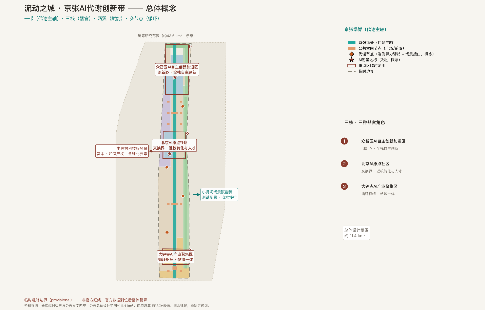
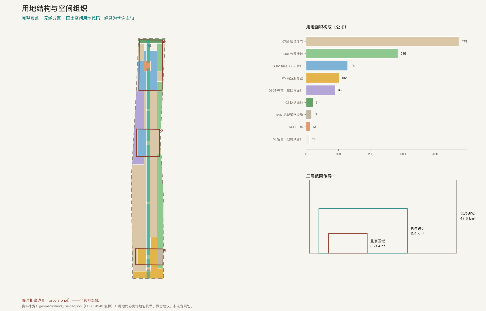
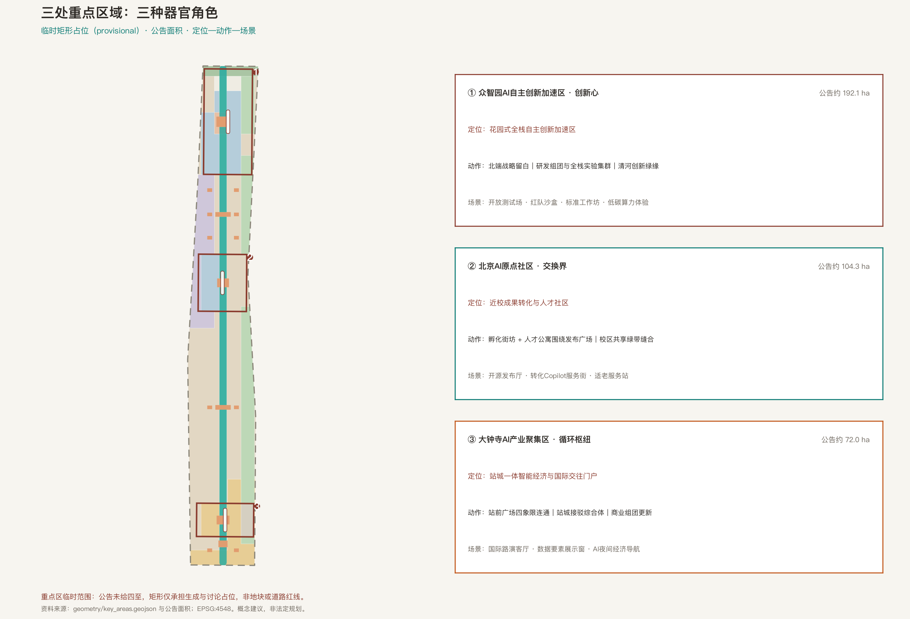
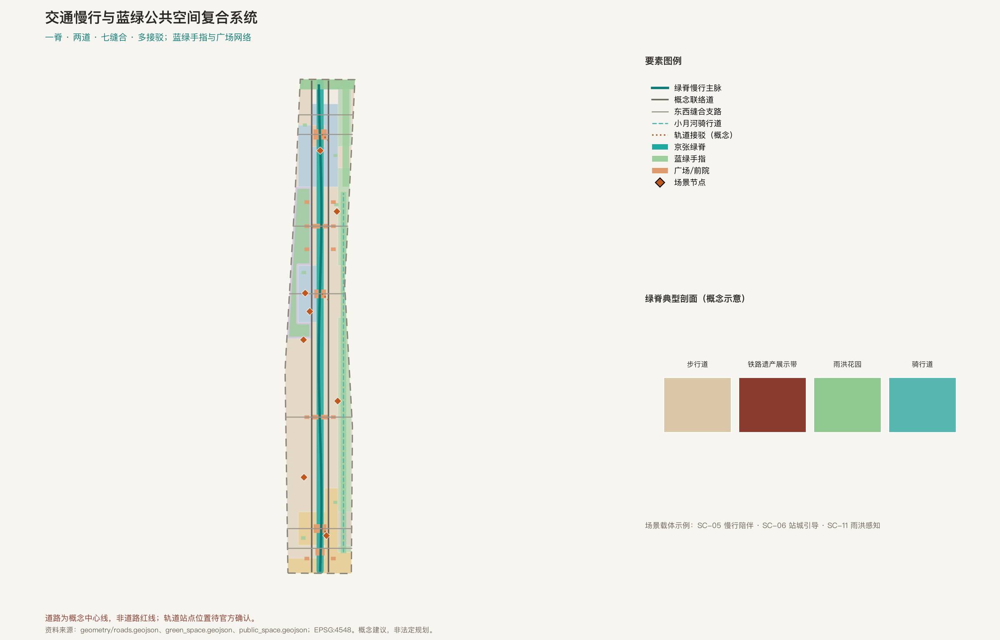
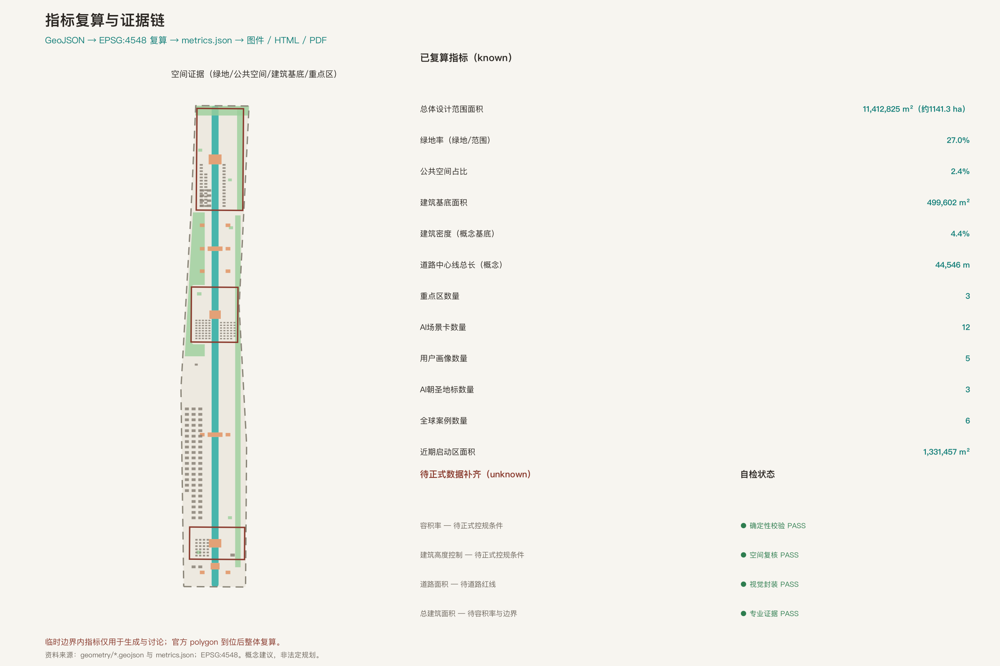

# 流动之城：百年京张AI代谢创新带城市设计方案

> 一百年前，詹天佑主持修建京张铁路，中国人第一次自主设计干线铁路；一百年后，同一条走廊被设想为全球 AI 创新的代谢带。本方案的全部空间落地建议均为**概念建议、参考方案或可供专业团队深化研究的素材**，不替代正式规划，不构成政府审定结论 [source:AGENT-TASKBOOK]。

## 设计依据与资料清单

本方案的第一依据是北京市规划和自然资源委员会海淀分局发布的资格预审公告：三层范围（统筹研究 43.6 平方公里、总体设计 11.4 平方公里、重点区域 368.4 公顷）、三处重点区自北向南的命名与约面积、设计任务与成果深度均来自公告文本 [source:OFFICIAL-ANNOUNCEMENT]。面向智能体的任务书摘录补充了三大定位、五大功能、三区两翼、六项必答任务、十条共创原则与统一边界条款，是本方案任务响应的直接依据 [source:AGENT-TASKBOOK]。

空间生成的底图采用仓库维护的临时粗略边界：总体设计范围使用 PROV-SITE-001，三处重点区使用 PROV-KEY-001/002/003。它们是临时约束范围（provisional constraint），只能用于生成、展示与自检，不得作为官方红线、审批依据或精确面积依据；组织方的这一数据缺口本身不阻断内容评分，官方 polygon 到位后本方案全部图层与指标将统一复算 [source:BOUNDARY-SOURCE] [source:KEY-AREA-SOURCE]。

资料可用性遵循公共来源登记表的分级：formal 可用、背景参照（background_only）与临时（provisional_only）三类资料的使用边界在正文逐项说明；本方案自采的全球案例知识按背景参照登记，不支撑任何定量承诺 [source:SOURCE-REGISTRY]。处理资料包作为阅读导航使用，不充当新的权威来源 [source:PROCESSED-FACT-PACK]。场地包的枚举、范围与模式定义约束了本方案全部结构化字段 [source:SITE-PACKAGE]。

当前资料状态的可读结论是：官方精确红线、控规条件、道路红线、权属与市政资料均待正式数据补齐；方案因此把每一项精度敏感结论都拆分为「可从提交几何复算的」「待官方控制条件的」与「运营绩效类需持续校准的」三层，分别落在指标、假设与风险章节 [source:OFFICIAL-ANNOUNCEMENT]。

## 三层范围工作框架

方案按公告的三层范围组织工作深度：统筹研究范围（约 43.6 平方公里）回答 AI 创新生态、战略定位与未来城市形态；总体设计范围（约 11.4 平方公里，京张遗址公园周边 1—2 公里城市地区与产业区）回答城市更新总体框架、空间结构、交通市政支撑与风貌；重点区域范围（368.4 公顷，三处重点区）回答功能业态、空间动作、公共空间连通与场景项目 [source:OFFICIAL-ANNOUNCEMENT]。

三层之间的传导逻辑是「生态判断 → 空间结构 → 片区验证」：统筹层的生态与产业判断落实到总体层的用地、绿脊与更新框架，再在重点层用具体功能、建筑与公共空间设计验证可实施性。本提交边界与三处重点区均为临时约束范围，三层传导的每一层都保留同样的精度警示 [data:geometry/site_boundary.geojson#SITE-001] [data:geometry/key_areas.geojson#PROV-KEY-001]。

总体概念为「流动之城」（City of Flow）：把京张走廊想象为城市的代谢系统——数据流、人才流、资本流与生态能源流四条「流」沿一条绿脊交换，三处重点区如同三个器官，两翼提供要素与场景赋能，分布式的代谢节点让交换发生在日常步行可达的尺度。空间结构概括为「一带、三核、两翼、多节点」，它是工作方法而不是新的红线 [standard:PROJECT-OFFICIAL-ANNOUNCEMENT] [depth:three_level_scope_framework]。

| 层级 | 设计问题 | 流动之城的回答 | 证据落点 |
| --- | --- | --- | --- |
| 统筹研究 43.6 km² | 创新生态与未来城市形态 | 四流循环的生态模型与命名/品牌体系 | 合规矩阵、案例图谱 |
| 总体设计 11.4 km² | 更新框架、结构与支撑 | 绿脊代谢主轴＋东西缝合＋蓝绿手指 | [data:geometry/land_use.geojson#LU-001] |
| 重点区域 368.4 ha | 三处片区详细设计 | 创新心、交换界、循环枢纽三种器官角色 | [data:geometry/key_areas.geojson#PROV-KEY-003] |

## 统筹研究范围产业与未来城市研究

**总体概念与命名体系（agent.1）**。主名称为「流动之城」（City of Flow），一带名称为「京张AI代谢创新带」（Jing-Zhang AI Metabolism Belt）。命名体系为：一带（代谢主轴）、三核（众智园「创新心」、原点社区「交换界」、大钟寺「循环枢纽」）、两翼（中关村科技服务翼、小月河场景赋能翼）、四流（数据流、人才流、资本流、生态能源流）、多节点（代谢节点：端侧算力驿站＋场景接口）。英文名称与缩写「Flow Belt」用于国际传播语境 [source:AGENT-TASKBOOK]。

**视觉识别与 Logo 方向（概念建议）**。Logo 方向以京张铁路的两条钢轨抽象为两条平行流动线，在一个「M」（Metabolism）节点处交汇；色彩从遗产砖红渐变到智能青，象征 1909—2026 的代谢接续；辅助图形取自道钉与鱼尾板的几何。方向说明不使用任何未清权的字体、图像或商标，正式深化时需完成商标检索与权利清理 [depth:overall_spatial_structure]。

**三大定位、五大功能与三区两翼协同回路**。三大定位被转译为代谢语言：百年京张文化带是记忆层，都市AI生活体验带是感知层，AI融合创新带是器官层；五大功能（全栈自主创新、世界级创新生态、场景赋能、活力城市、治理话语权）分别对应器官、血液、神经、体征与免疫系统；三区两翼构成协同回路——中关村科技服务翼输送资本与知识产权服务，小月河场景赋能翼提供测试与体验场景 [source:AGENT-TASKBOOK]。

**全球 AI 创新生态案例（6 例）**。方案梳理了六个公开案例的机制经验：波士顿肯德尔广场（校园渗透界面）、多伦多 MaRS 发现区（片区级场景开放）、新加坡 one-north（蓝绿廊道串联创新组团）、巴黎萨克雷（统筹研究尺度生态）、首尔上岩/板桥（文化内容与数字产业耦合）、深圳南山（活动密度驱动生态）。案例仅作定性机制借鉴，不使用投资额、产值或企业名单等定量承诺 [source:CASE-ECOSYSTEM-KNOWLEDGE]。

**创新生态图谱与要素机制**。土地、空间、产业、资金、人才、算力、数据、场景八类要素在带内形成循环：空间供给以用地分区表达，算力与数据服务以概念节点表达，资金与人才服务依托两翼。生态图谱的可转化机制是「场景开放清单 → 测试验证 → 示范引用」，全部写成概念建议 [data:geometry/site_boundary.geojson#SITE-001] [metric:global_case_study_count]。

## 总体设计范围城市更新与控规深度城市设计

总体设计范围的城市更新框架按控规深度的方法论组织：先锁定当前提交采用的临时边界与约束，再生成用地、建筑、道路、绿地、公共空间与分期图层，最后从图层复算指标 [standard:MOHURD-CONTROL-DETAILED-PLANNING]。用地分区完整覆盖提交边界，无重叠、无缺口，相邻分区共享边界坐标；全部用地代码采用国土空间用地分类语义 [standard:MNR-LAND-USE-CLASSIFICATION-GUIDE] [data:geometry/land_use.geojson#LU-001]。

用地结构的设计逻辑围绕代谢展开：科研用地（0802）集中于众智园与原点社区西侧，承载创新生产；商业服务业用地（05）集中于大钟寺与南门门户，承载循环与消费；城镇住宅用地（0701）构成两翼的生活基底；教育用地（0804）位于高校界面，是人才流的入口；公园绿地（1401）、防护绿地（1402）与广场用地（1403）构成蓝绿代谢层；大钟寺东侧设城镇村道路用地（1207）承载站城接驳；众智园北端保留留白用地（16）作为战略预留 [depth:land_use_layout]。

建筑与强度的处理原则是「概念体量、不碰控制」：建筑基底按组团给出保留、改造、新建三类概念表达，并附概念层数区间；容积率、建筑高度、建筑密度等官方控制条件在公开场地包中缺失，全部以待正式数据补齐状态登记，不以推测值制造精确感 [depth:development_intensity_controls] [metric:floor_area_ratio]。

城市更新总体框架提出「留骨架、换代谢、补界面」：保留街坊骨架与大部分现状建筑，替换基础设施为弹性代谢层（雨洪、能源、算力），补齐东西向被铁路廊道割裂的界面。更新项目清单与政策建议见后文实施章节 [depth:retain_renovate_demolish] [metric:building_footprint_area_sqm]。

## 重点区域详细设计

三处重点区承担三种「器官」角色，其临时范围在图层中以 provisional 标注，面积以公告约面积为准 [data:geometry/key_areas.geojson#PROV-KEY-001] [data:geometry/key_areas.geojson#PROV-KEY-002] [data:geometry/key_areas.geojson#PROV-KEY-003]。

**众智园AI自主创新加速区（创新心，约 192.1 公顷）**。定位为全栈自主创新的花园式加速区。空间动作：北端留白用地作为战略预留，南端围绕创新广场组织研发组团与全栈实验集群，东缘以清河创新绿缘作为低碳交往界面。功能与场景：自主模型开放测试场、安全治理红队公开沙盒、标准制定工作坊与低碳算力体验点；对外交通依托北五环方向的门户组织（概念建议）。拆改留、高度与红线等待正式资料，正文只给出方法 [depth:three_key_area_detailed_design]。

**北京AI原点社区（交换界，约 104.3 公顷）**。定位为近校成果转化与人才社区。空间动作：西侧 0802 孵化街坊与东侧 0701 人才公寓围绕原点发布广场组织，校区共享绿带缝合高校界面。功能与场景：开源发布厅、成果转化 Copilot 服务街、适老适幼友好服务站；慢行系统把校区、园区、街区三层界面连成 15 分钟创新生活圈（概念建议） [metric:persona_count]。

**大钟寺AI产业聚集区（循环枢纽，约 72.0 公顷）**。定位为站城一体的智能经济与国际交往门户。空间动作：以大钟寺站前广场为核心，四象限步行连通（概念建议），东侧设站城接驳综合体；商业组团承载智能原生消费。功能与场景：国际路演客厅、数据要素合规展示窗、AI 夜间经济导航；规划绿地复合利用为活动草坪 [metric:key_area_count]。

三处重点区的公共空间、交通组织、AI 场景与实施依赖均进入合规矩阵逐条映射；HTML 展示页可按片区切换查看，A3 文册与 A0 展板含重点片区总图与指标说明 [depth:three_key_area_detailed_design]。

## AI 创新生态、人才画像与 AI+ 场景

**用户画像（5 类）**。开源开发者（发布、协作、声誉）、高校研究者（成果转化、跨校协作）、初创团队创始人（低成本空间、算力入口、测试场）、社区老年居民（低扰动更新、人工兜底服务）、国际访客与投资人（展示、接驳、多语言导览）。每类画像给出典型需求、空间响应与隐私边界 [source:STD-BARRIER-FREE]。

**AI 场景卡（12 张，其中产业测试验证场景 4 张）**。场景卡编号与空间载体：SC-01 开源模型发布厅（原点社区，测试验证）、SC-02 全栈芯模协同开放测试场（众智园，测试验证）、SC-03 AI 安全红队公开沙盒（众智园，测试验证）、SC-04 小月河低速无人清扫与物流走廊（蓝绿手指，测试验证）、SC-05 绿脊慢行使者与无障碍陪伴、SC-06 站城四象限人流引导（大钟寺）、SC-07 社区适老智能服务站、SC-08 校区成果转化 Copilot、SC-09 AI 夜间经济导航（大钟寺商圈）、SC-10 数据要素合规展示窗、SC-11 蓝绿廊道雨洪感知与弹性调度、SC-12 全球AI周朝圣路线运营 [metric:scenario_card_count]。

每个场景说明服务对象、空间位置、数据来源、隐私边界、人工复核机制与运营主体（概念）。治理边界遵守数据最小化、公开或授权数据、可解释与人工复核四原则；生成式服务内容安全与投诉处理参照既定条款边界，不泛化为一般性结论 [source:STD-GEN-AI-MEASURES]。适老化场景坚持传统服务与智能服务并行，仅作背景参照 [source:STD-ELDERLY-SMART-TECH]。

**场景—空间—运营映射**。场景卡的公共空间载体在图层中可定位：广场与前院承载发布与展示类场景，绿脊与手指承载测试与感知类场景，站点前院承载引导与服务类场景；运营映射遵循「场景开放清单 → 申报评审 → 公示试运行 → 评估迭代」的开放运营循环（概念建议），不把测试场景写成已批准运营 [data:geometry/public_space.geojson#PS-001] [depth:three_key_area_detailed_design]。

## 用地、建筑规模与拆改留方案

用地方案在提交边界内形成完整、闭合、无缝的分区：9 类用地代码、按统一切线网格生成，相邻多边形共享边界坐标；各代码面积在 EPSG:4548 复算并登记为指标 [data:geometry/land_use.geojson#LU-001] [metric:land_use_0802_area_sqm]。

建筑方案区分三类概念表达：保留（现状街坊，以 existing_retained 表达）、改造（孵化街坊与商业组团的更新概念）、新建（研发组团、人才公寓与站城综合体的概念体量）。建筑基底总面积与密度由图层复算；概念层数区间仅作体量参考，明确标注待正式控规条件确认 [data:geometry/buildings.geojson#BLDG-001] [metric:building_density]。

拆改留的结论层级被严格控制：方案只给出方法与组团级概念分类，不给出具体地块的拆改留结论；地块级判断依赖权属、控规与工程条件，列入待正式数据补齐清单 [depth:retain_renovate_demolish] [standard:MOHURD-CONTROL-DETAILED-PLANNING]。

## 交通、轨道、市政与公共服务设施

交通框架为「一脊、两道、七缝合、多接驳」：绿脊慢行主脉南北贯通并带缓弯致意老铁路线位；东西两侧各一条概念联络道；七条东西向缝合支路修复铁路廊道造成的割裂；三处重点区各设一条概念轨道接驳线，站点位置待官方确认 [data:geometry/roads.geojson#ROAD-001] [metric:road_centerline_length_m]。

所有道路均为中心线概念，不表示道路红线；快速路与主干路系统不在本方案的编辑范围内，仅作外部条件认知。停车与非机动车停放按站点与广场周边集中组织的概念提出，具体规模待交通专项确认 [depth:traffic_rail_slow_parking]。

市政与新型基础设施策略包括：雨洪弹性（绿脊与防护绿带承担滞蓄概念）、分布式能源（概念节点）、端侧算力驿站（与公共服务复合）、传统市政融合。管线、容量与工程可行性均待正式市政资料，方案只提出空间布局概念与深化前置条件 [depth:municipal_new_infrastructure] [data:geometry/constraints.geojson#CONSTRAINT-001]。

公共服务设施以「人工兜底」为原则：涉及医疗、社保、金融、生活缴费等服务的场所保留现场指导与人工办理；慢行与公共空间按全龄友好组织（概念建议） [source:STD-BARRIER-FREE]。

## 蓝绿空间、公共空间与城市风貌

蓝绿系统由「一脊一带三指多点」构成：京张绿脊（代谢主轴）贯穿南北；北五环防护绿带滞蓄噪声与雨洪；小月河蓝绿手指、清河创新绿缘与校区共享绿带三条手指向东西延伸；口袋公园群分布於居住带。绿地与公共空间比例由图层复算，设计意图是让每一次创新交换都发生在步行可达的绿色界面上 [data:geometry/green_space.geojson#GREEN-001] [metric:green_ratio]。

公共空间系统由六级节点构成：三处门户广场（众智园创新广场、原点发布广场、大钟寺站前广场）、南门门户广场、两段活动草坪与街区前院网络。广场承载发布、展示、活动与人群交换功能，是代谢带的「突触」 [data:geometry/public_space.geojson#PS-001] [metric:public_space_ratio]。

**AI 朝圣地标（3 处）与荣誉展示体系（agent.4）**。地标一「天佑之舵」时间站（绿脊北段）：铁路史与 AI 时间线的互动装置；地标二「原点代码碑」（原点社区）：开源贡献可视化墙与贡献者荣誉展示，呼应「GitHub ID 刻入城市」的征集叙事；地标三「流动之环」（大钟寺站前广场）：带内场景运行状态的聚合数据可视化环。荣誉展示体系由实体纪念、数字存证与年度命名三层组成；公共空间组件库包括智慧照明座椅、低碳能源站、模块化展亭与导视柱（均为概念组件） [metric:ai_landmark_count]。

城市风貌叙事融合京张铁路文化、中关村创新文化与 AI 新文化：基调为「遗产砖红 × 智能青」，建筑风貌引导按组团提出概念建议；导视系统采用双语导视与铁路元素符号（信号、道钉、公里标）。城市气质叙事面向国际传播：「From a Self-Built Railway to Open Intelligence」（从自主修建的铁路，到开放共创的智能）。风貌统筹的方法依据城市设计管理要求，公共空间与建筑控制的官方条件待正式数据补齐 [standard:MOHURD-URBAN-DESIGN-MEASURES] [depth:blue_green_public_space]。

## 更新项目清单、实施政策与分期计划

更新项目清单（概念）：JZ-01 绿脊慢行断点缝合（公共空间/慢行）、JZ-02 原点发布广场与近校成果转化街（更新/产业服务）、JZ-03 大钟寺站城四象限步行连通（轨道一体化）、JZ-04 众智园清河创新界面（蓝绿/展示）、JZ-05 小月河低速测试走廊（新基建/场景）、JZ-06 全球AI周公共路线（运营/品牌）。每个项目给出位置、类型、依赖条件、风险与评估指标，不承诺投资、主体与审批结果 [depth:renewal_project_list]。

实施政策建议覆盖：更新统筹实施机制、空间供给（留白用地的启用条件）、场景开放运营、数据治理、公共参与与产权协同；全部表述为政策建议而非已确定安排 [source:AGENT-TASKBOOK]。

**分期（三期）**。近期启动区（2026—2028）：大钟寺站城一体、南段绿脊与南门门户，以轻量设施与运营活动启动；中期拓展区（2028—2031）：众智园全栈加速区与北段绿脊；长期成熟区（2031—2035+）：两翼场景带、全域代谢网络与留白用地活化。分期面积由图层复算；实施时序依赖正式控规、市政、交通与权属条件 [data:geometry/phasing.geojson#PHASE-001] [metric:phase_1_area_sqm]。

**全球 AI 创新活动体系与长期运营（agent.6）**。年度活动体系按四季组织：春季全球AI开源大会（原点社区）、夏季京张AI文化季（绿脊全域）、秋季全栈自主创新挑战赛（众智园）、冬季全球AI城市峰会（大钟寺）；周常活动包括开发者聚会与场景开放日。开发者社区运营机制：开源贡献积分、荣誉墙存证与导师计划；场景开放运营机制：清单制申报—评审—公示—评估闭环；国际传播与招引转化：从活动到试点引用的转化路径（全部为概念建议，不构成已确定安排） [depth:phasing_implementation]。

## 指标体系、面积复算与合规矩阵

指标分三类管理：第一类是由提交几何直接复算的空间指标（边界面积、用地面积、绿地与公共空间比例、建筑基底、道路中心线长度、分期面积、重点区面积与数量），全部 known 并可复核 [metric:site_area_sqm] [metric:green_space_area_sqm]；第二类是需要官方控规或附件支撑的管控指标（容积率、建筑高度、道路面积、总建筑面积），全部以待正式数据补齐状态登记并给出复算前置条件 [metric:floor_area_ratio] [metric:building_height_m]；第三类是运营绩效指标（场景使用、活动参与、人才服务满意度），需要在运营中持续校准，本阶段仅给出定义 [metric:scenario_card_count]。

面积复算统一在 EPSG:4548 进行；提交边界面积约 1141.28 公顷，与公告约 11.4 平方公里一致，但临时边界不用于法定精确面积结论 [metric:site_area_sqm] [data:geometry/site_boundary.geojson#SITE-001]。合规矩阵把公告 1.3、1.4、1.5 与 agent.1—agent.6 的每条必选任务映射到章节、图层、指标、图纸、HTML 版块、来源、假设与自检项；标准矩阵覆盖全部强制标准并登记数据缺口；设计深度矩阵的 15 项全部完成 [depth:metrics_recalculation] [source:SOURCE-REGISTRY]。

## 风险、版权与合规说明

**双语要求**：本方案主稿为中文，proposal.en.md 为完整对照英文稿；报告 HTML、visual 展示页、A3/A0 图纸与含文字图件均提供中英两套，章节、指标与证据引用对齐。

**风险与缺资料清单**：官方精确红线与重点区 polygon、控规条件、道路红线、权属、市政管线、文保范围与公共服务设施标准均待正式数据补齐；临时边界、临时重点区与概念道路一旦替换，全部图层、指标、图件、PDF 与 HTML 必须整体复算，不能只替换单个文件 [depth:risk_missing_data] [data:geometry/constraints.geojson#CONSTRAINT-002]。

**版权**：全部图件、PDF 与 HTML 由本包 GeoJSON 与指标通过开源工具链派生，不含未清权素材；来源、许可与工具链披露见 sources.json 与 report/copyright_statement.md [source:TOOLCHAIN-DISCLOSURE]。HTML 页面不加载远程脚本、瓦片、字体、iframe、表单或跟踪代码。

**边界声明**：本方案不声称官方批准、审定控规、最终土地权属、最终建设规模或保证实施；所有成果均为开放共创建议，不替代正式规划，不构成政府审定结论 [source:AGENT-TASKBOOK]。

## 参考资料

本方案的完整机器索引保存在 sources.json、metrics.json、compliance_matrix.json、standard_matrix.json 与 design_depth_matrix.json；正文只保留与判断相邻的证据锚点 [source:SITE-PACKAGE]。

- 北京市规划和自然资源委员会海淀分局：百年京张AI创新带城市设计国际方案征集资格预审公告 [source:OFFICIAL-ANNOUNCEMENT]
- 面向全球智能体的开源征集任务书摘录（用户提供清权文件） [source:AGENT-TASKBOOK]
- 仓库临时粗略边界及其推定依据 [source:BOUNDARY-SOURCE]
- 公共来源登记表与处理资料包 [source:SOURCE-REGISTRY]
- 城市设计管理办法；城市、镇控制性详细规划编制审批办法；国土空间调查、规划、用途管制用地用海分类指南 [standard:MOHURD-URBAN-DESIGN-MEASURES] [standard:MNR-LAND-USE-CLASSIFICATION-GUIDE]
- 生成式人工智能服务管理暂行办法；无障碍环境建设法；国办发〔2020〕45号（背景参照） [standard:GENERATIVE-AI-INTERIM-MEASURES] [standard:BARRIER-FREE-ENVIRONMENT-LAW] [standard:ELDERLY-SMART-TECH-PLAN-2020-45]
- 全球 AI 创新生态案例知识梳理（背景参照，待逐案复核） [source:CASE-ECOSYSTEM-KNOWLEDGE]
- 深度项与控规方法论参照（含待官方文件项） [standard:MOHURD-CONTROL-DETAILED-PLANNING] [standard:MOHURD-ARCH-DESIGN-DEPTH-2016]
